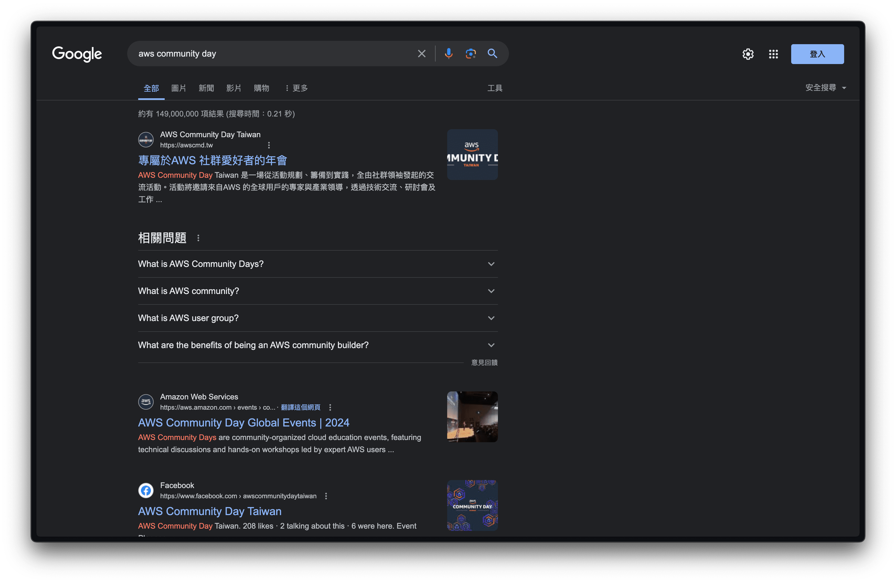

# AWS Community Day Taiwan 2023

We use astro to build this website and ❤️

[](https://vercel.com/new/clone?repository-url=https%3A%2F%2Fgithub.com%2Fkane50613%2Faws-community-day-taiwan-2023)

## Why Astro?

Our goal is to create the most SEO-optimized static website possible. We aim to construct a website primarily composed of static content, with the only interactive component being the [EmailForm](./src/components/EmailForm.tsx).

If we can achieve the developer experience (DX) of using React while also exporting all content as static HTML, it would be an ideal solution for us. This approach would significantly enhance our SEO and allow for faster page loading times.

Astro is the ideal choice for our needs. The [Astro Island](https://docs.astro.build/en/concepts/islands/#creating-an-island) feature ensures that the EmailForm component is hydrated only when it becomes visible in the browser, thereby ensuring that no JavaScript is loaded upon visiting the site.



The results clearly demonstrate that we've achieved our goals!

## To Deploy

To deploy the website to S3 and revalidate caches from CloudFront, run the following command:

```bash
pnpm run deploy
```

## To Develop

To start the development server, use the following command:

```bash
pnpm run dev
```
